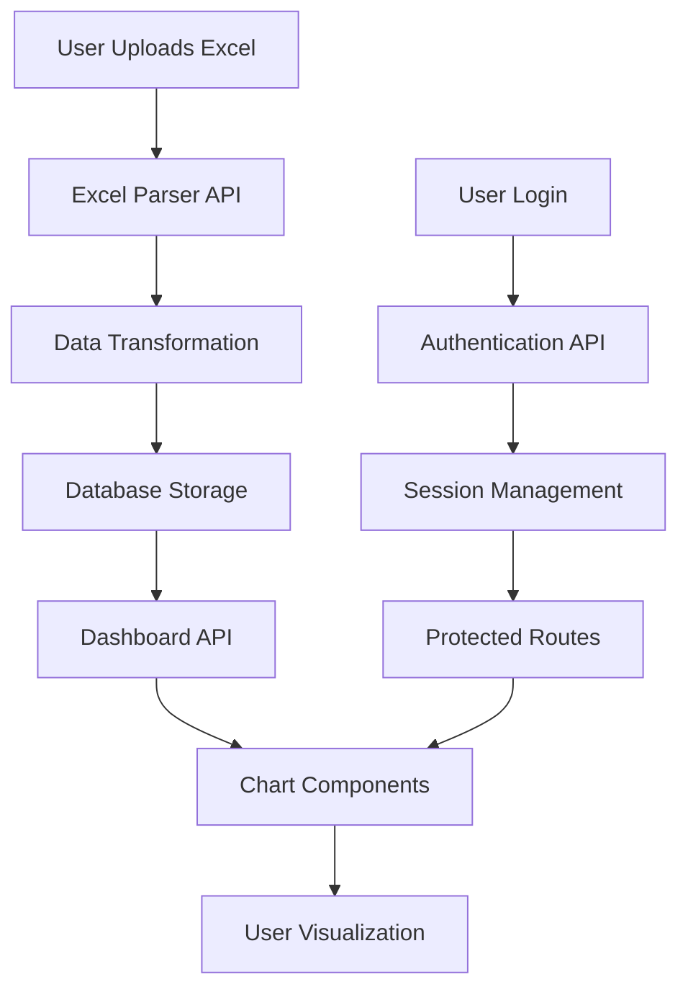

# AIBUILD Dashboard - System Architecture & Data Design

## 1. System Architecture Overview

### High-Level Architecture
```
┌─────────────────────────────────────────────────────────┐
│                    CLIENT TIER                          │
├─────────────────────────────────────────────────────────┤
│  Next.js Frontend (React Components)                   │
│  ├─ Authentication Pages                               │
│  ├─ File Upload Interface                              │
│  ├─ Dashboard & Charts                                 │
│  └─ Product Selection & Comparison                     │
└─────────────────────────────────────────────────────────┘
                            │
                            ▼
┌─────────────────────────────────────────────────────────┐
│                APPLICATION TIER                         │
├─────────────────────────────────────────────────────────┤
│  Next.js API Routes                                     │
│  ├─ /api/auth/*           Authentication                │
│  ├─ /api/upload           Excel File Processing         │
│  ├─ /api/products/*       Product Data CRUD             │
│  ├─ /api/dashboard/*      Chart Data Aggregation        │
│  └─ Middleware            Session & Route Protection    │
└─────────────────────────────────────────────────────────┘
                            │
                            ▼
┌─────────────────────────────────────────────────────────┐
│                   DATA TIER                             │
├─────────────────────────────────────────────────────────┤
│  PostgreSQL Database                                    │
│  ├─ Users Table                                         │
│  ├─ Products Table                                      │
│  ├─ DailyData Table                                     │
│  └─ Indexes for Performance                             │
└─────────────────────────────────────────────────────────┘
```

## 2. Data Model Design

### 2.1 Database Schema (Prisma)

```prisma
// prisma/schema.prisma

model User {
  id        String   @id @default(cuid())
  username  String   @unique
  email     String?  @unique
  password  String   // bcrypt hashed
  createdAt DateTime @default(now())
  updatedAt DateTime @updatedAt
  
  // Relationships
  products  Product[]
  
  @@map("users")
}

model Product {
  id               String   @id @default(cuid())
  productId        String   // From Excel (e.g., "0000001")
  productName      String
  openingInventory Int
  createdAt        DateTime @default(now())
  updatedAt        DateTime @updatedAt
  
  // Foreign Keys
  userId           String
  user             User     @relation(fields: [userId], references: [id], onDelete: Cascade)
  
  // Relationships
  dailyData        DailyData[]
  
  // Indexes
  @@unique([userId, productId]) // Prevent duplicate products per user
  @@index([userId])
  @@map("products")
}

model DailyData {
  id                 String   @id @default(cuid())
  date               DateTime // Instead of day number - more flexible
  daySequence        Int      // 1, 2, 3... for ordering within import batch
  
  // Raw Excel Data - nullable to handle missing values
  procurementQty     Int?     @default(0)
  procurementPrice   Float?   @default(0)
  salesQty           Int?     @default(0)
  salesPrice         Float?   @default(0)
  
  // Calculated Fields
  inventoryLevel     Int?     // Nullable if can't be calculated
  procurementAmount  Float?   // Handle null prices
  salesAmount        Float?   // Handle null prices
  
  // Import metadata
  importBatchId      String?  // Track which Excel file this came from
  sourceRow          Int?     // Original Excel row number for debugging
  
  createdAt          DateTime @default(now())
  
  // Foreign Keys
  productId          String
  product            Product  @relation(fields: [productId], references: [id], onDelete: Cascade)
  
  @@unique([productId, date])
  @@index([productId, daySequence])
  @@index([importBatchId])
  @@map("daily_data")
}
```

### 2.2 Data Transformation Logic

```typescript
// lib/dataTransformation.ts

interface ExcelRow {
  ID: string;
  'Product Name': string;
  'Opening Inventory': number;
  'Procurement Qty (Day 1)': number;
  'Procurement Price (Day 1)': number;
  'Procurement Qty (Day 2)': number;
  'Procurement Price (Day 2)': number;
  'Procurement Qty (Day 3)': number;
  'Procurement Price (Day 3)': number;
  'Sales Qty (Day 1)': number;
  'Sales Price (Day 1)': number;
  'Sales Qty (Day 2)': number;
  'Sales Price (Day 2)': number;
  'Sales Qty (Day 3)': number;
  'Sales Price (Day 3)': number;
}

interface ProcessedProduct {
  productId: string;
  productName: string;
  openingInventory: number;
  dailyData: ProcessedDailyData[];
}

interface ProcessedDailyData {
  day: number;
  procurementQty: number;
  procurementPrice: number;
  salesQty: number;
  salesPrice: number;
  inventoryLevel: number;
  procurementAmount: number;
  salesAmount: number;
}

export function transformExcelData(excelRows: ExcelRow[]): ProcessedProduct[] {
  return excelRows.map(row => {
    let runningInventory = row['Opening Inventory'];
    
    const dailyData: ProcessedDailyData[] = [];
    
    // Process each day
    for (let day = 1; day <= 3; day++) {
      const procQty = row[`Procurement Qty (Day ${day})`] || 0;
      const procPrice = row[`Procurement Price (Day ${day})`] || 0;
      const salesQty = row[`Sales Qty (Day ${day})`] || 0;
      const salesPrice = row[`Sales Price (Day ${day})`] || 0;
      
      // Calculate inventory for this day
      runningInventory = runningInventory + procQty - salesQty;
      
      dailyData.push({
        day,
        procurementQty: procQty,
        procurementPrice: procPrice,
        salesQty: salesQty,
        salesPrice: salesPrice,
        inventoryLevel: runningInventory,
        procurementAmount: procQty * procPrice,
        salesAmount: salesQty * salesPrice
      });
    }
    
    return {
      productId: row.ID,
      productName: row['Product Name'],
      openingInventory: row['Opening Inventory'],
      dailyData
    };
  });
}
```

## 3. Application Architecture

### 3.1 Folder Structure
```
src/
├── app/                          # Next.js 13+ App Router
│   ├── (auth)/
│   │   ├── login/page.tsx
│   │   └── register/page.tsx
│   ├── dashboard/
│   │   ├── page.tsx              # Main dashboard
│   │   └── upload/page.tsx       # Excel upload
│   ├── api/
│   │   ├── auth/
│   │   │   ├── login/route.ts
│   │   │   ├── register/route.ts
│   │   │   └── logout/route.ts
│   │   ├── upload/route.ts       # Excel file processing
│   │   ├── products/
│   │   │   ├── route.ts          # List products
│   │   │   └── [id]/route.ts     # Get product details
│   │   └── dashboard/
│   │       └── chart-data/route.ts
│   ├── layout.tsx
│   └── page.tsx
├── components/
│   ├── ui/                       # Reusable UI components
│   │   ├── Button.tsx
│   │   ├── Input.tsx
│   │   └── Card.tsx
│   ├── auth/
│   │   ├── LoginForm.tsx
│   │   └── AuthGuard.tsx
│   ├── dashboard/
│   │   ├── ProductChart.tsx
│   │   ├── ProductSelector.tsx
│   │   ├── ComparisonView.tsx
│   │   └── FileUpload.tsx
│   └── layout/
│       ├── Header.tsx
│       └── Sidebar.tsx
├── lib/
│   ├── auth.ts                   # Authentication utilities
│   ├── database.ts               # Prisma client
│   ├── dataTransformation.ts     # Excel processing
│   ├── chartHelpers.ts           # Chart data formatting
│   └── validation.ts             # Input validation
├── types/
│   ├── auth.ts
│   ├── product.ts
│   └── api.ts
└── middleware.ts                 # Route protection
```

### 3.2 Data Flow Architecture



## 4. API Design

### 4.1 Authentication Endpoints
```typescript
// POST /api/auth/register
interface RegisterRequest {
  username: string;
  password: string;
  email?: string;
}

// POST /api/auth/login  
interface LoginRequest {
  username: string;
  password: string;
}

// POST /api/auth/logout
// No body required
```

### 4.2 Data Management Endpoints
```typescript
// POST /api/upload
interface UploadRequest {
  file: FormData; // Excel file
}

interface UploadResponse {
  success: boolean;
  message: string;
  productsProcessed: number;
  errors?: string[];
}

// GET /api/products
interface ProductsResponse {
  products: {
    id: string;
    productId: string;
    productName: string;
    openingInventory: number;
  }[];
}

// GET /api/products/[id]
interface ProductDetailResponse {
  product: {
    id: string;
    productId: string;
    productName: string;
    openingInventory: number;
    dailyData: {
      day: number;
      inventoryLevel: number;
      procurementAmount: number;
      salesAmount: number;
    }[];
  };
}
```

### 4.3 Chart Data Endpoint
```typescript
// GET /api/dashboard/chart-data?products=id1,id2,id3
interface ChartDataResponse {
  products: {
    [productId: string]: {
      name: string;
      data: {
        day: number;
        inventory: number;
        procurement: number;
        sales: number;
      }[];
    };
  };
}
```

## 5. Frontend Architecture

### 5.1 State Management Strategy
```typescript
// Using React hooks + Context for state management

// contexts/AppContext.tsx
interface AppState {
  user: User | null;
  selectedProducts: string[];
  products: Product[];
  chartData: ChartData | null;
  loading: boolean;
}

interface AppActions {
  setUser: (user: User | null) => void;
  setSelectedProducts: (productIds: string[]) => void;
  setProducts: (products: Product[]) => void;
  setChartData: (data: ChartData) => void;
  setLoading: (loading: boolean) => void;
}

export const useAppContext = () => {
  const context = useContext(AppContext);
  if (!context) {
    throw new Error('useAppContext must be used within AppProvider');
  }
  return context;
};
```

### 5.2 Component Architecture
```typescript
// components/dashboard/ProductChart.tsx
interface ProductChartProps {
  productData: {
    name: string;
    data: Array<{
      day: number;
      inventory: number;
      procurement: number;
      sales: number;
    }>;
  }[];
  height?: number;
  showComparison?: boolean;
}

export const ProductChart: React.FC<ProductChartProps> = ({
  productData,
  height = 400,
  showComparison = false
}) => {
  // Chart implementation using Recharts
  return (
    <ResponsiveContainer width="100%" height={height}>
      <LineChart>
        <CartesianGrid strokeDasharray="3 3" />
        <XAxis dataKey="day" />
        <YAxis />
        <Tooltip />
        <Legend />
        
        {productData.map((product, index) => (
          <React.Fragment key={product.name}>
            <Line 
              type="monotone" 
              dataKey="inventory" 
              stroke={COLORS.inventory[index]} 
              name={`${product.name} - Inventory`}
            />
            <Line 
              type="monotone" 
              dataKey="procurement" 
              stroke={COLORS.procurement[index]} 
              name={`${product.name} - Procurement`}
            />
            <Line 
              type="monotone" 
              dataKey="sales" 
              stroke={COLORS.sales[index]} 
              name={`${product.name} - Sales`}
            />
          </React.Fragment>
        ))}
      </LineChart>
    </ResponsiveContainer>
  );
};
```

## 6. Performance Considerations

### 6.1 Database Optimization
```sql
-- Indexes for optimal query performance
CREATE INDEX idx_products_user_id ON products(user_id);
CREATE INDEX idx_daily_data_product_id ON daily_data(product_id);
CREATE INDEX idx_daily_data_product_day ON daily_data(product_id, day);

-- Composite index for chart queries
CREATE INDEX idx_chart_data ON daily_data(product_id, day, inventory_level, procurement_amount, sales_amount);
```

### 6.2 Frontend Performance
```typescript
// Lazy loading for large datasets
const ProductChart = React.lazy(() => import('./ProductChart'));

// Memoization for expensive calculations
const chartData = useMemo(() => {
  return transformDataForChart(rawData);
}, [rawData]);

// Virtual scrolling for product lists
import { FixedSizeList as List } from 'react-window';
```

### 6.3 API Response Optimization
```typescript
// Pagination for product lists
interface PaginatedResponse<T> {
  data: T[];
  pagination: {
    page: number;
    limit: number;
    total: number;
    hasNext: boolean;
    hasPrev: boolean;
  };
}

// Data compression for chart endpoints
app.use(compression());
```

## 7. Security Architecture

### 7.1 Authentication Security
```typescript
// Password hashing
import bcrypt from 'bcryptjs';

export async function hashPassword(password: string): Promise<string> {
  return bcrypt.hash(password, 12);
}

// JWT token management
import jwt from 'jsonwebtoken';

export function generateToken(userId: string): string {
  return jwt.sign({ userId }, process.env.JWT_SECRET!, { expiresIn: '24h' });
}
```

### 7.2 API Security
```typescript
// Rate limiting
import rateLimit from 'express-rate-limit';

const uploadLimiter = rateLimit({
  windowMs: 15 * 60 * 1000, // 15 minutes
  max: 5, // 5 uploads per window
});

// Input validation
import { z } from 'zod';

const loginSchema = z.object({
  username: z.string().min(3).max(50),
  password: z.string().min(6).max(100)
});
```

## 8. Deployment Architecture

### 8.1 Environment Configuration
```typescript
// Environment variables
interface EnvConfig {
  DATABASE_URL: string;
  JWT_SECRET: string;
  NEXTAUTH_SECRET: string;
  NEXTAUTH_URL: string;
  NODE_ENV: 'development' | 'production';
}
```

### 8.2 Production Deployment
```yaml
# docker-compose.yml for containerization
version: '3.8'
services:
  app:
    build: .
    ports:
      - "3000:3000"
    environment:
      - DATABASE_URL=postgresql://user:pass@db:5432/aibuild
    depends_on:
      - db
      
  db:
    image: postgres:15
    environment:
      - POSTGRES_DB=aibuild
      - POSTGRES_USER=user
      - POSTGRES_PASSWORD=pass
    volumes:
      - postgres_data:/var/lib/postgresql/data

volumes:
  postgres_data:
```

This architecture provides a scalable, maintainable, and secure foundation for the AIBUILD dashboard while meeting all the core requirements efficiently.